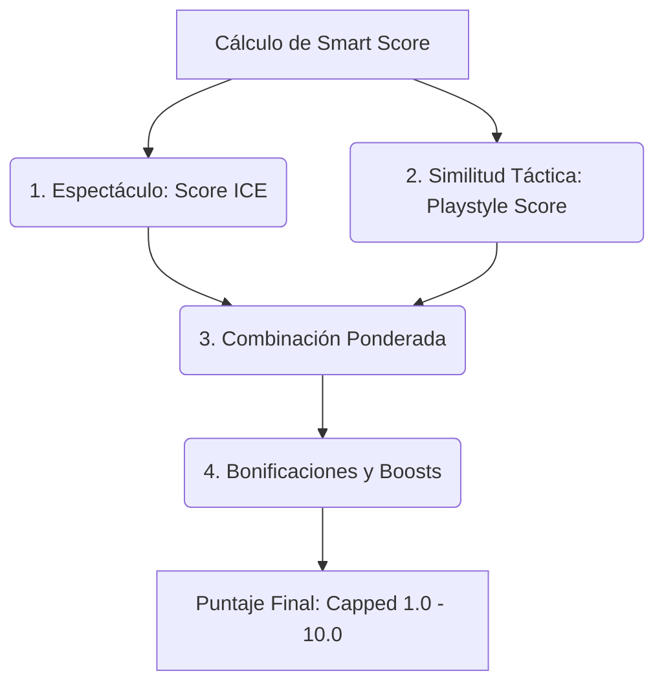

# Análisis del Sistema Recomendador (Smart Score)

El sistema recomendador de la aplicación **worldcup-app** se encarga de calcular un **"Smart Score"** (puntaje inteligente) personalizado para cada partido. Este puntaje oscila en el rango de `1.0` a `10.0` y representa la afinidad del partido para el usuario actual.

El cálculo se realiza en el archivo [scoring.js](file:///c:/Users/tomas/Desktop/proyectos/worldcup-app/frontend/js/scoring.js) a través de la función principal `calculateSmartScore(match, teams, tacticalVector)`.

---

## Estructura General del Algoritmo

El cálculo unifica dos componentes fundamentales (Espectáculo e Identidad Táctica), aplica ponderaciones parametrizables por el usuario y añade una serie de bonificaciones basadas en sus preferencias explícitas (favoritos, edad de la plantilla y test de afinidad).

---

## Paso a Paso del Algoritmo

### 1. Inicialización y Casos Especiales
* **Partidos por Definir (TBD):** Si uno o ambos equipos son placeholders (ej. "Ganador Grupo A"), se calcula y devuelve únicamente el score de espectáculo base (ICE) y se le asigna un score de estilo por defecto de `5.0`.
* **Falta de Datos:** Si no se encuentran métricas de alguno de los equipos en el dataset, el sistema actúa de forma análoga retornando la base de espectáculo.

### 2. Fase 1: Score de Espectáculo (ICE)
Calcula el Índice de Competitividad y Espectáculo objetivo del cruce:
* **Fusión de Métricas:** Promedia las métricas normalizadas de los contendientes (`ocasiones_norm`, `contra_norm`, `drama_norm`, `vuln_norm`).
* **Amplificación por Vulnerabilidad:** El peligro generado por ocasiones claras se escala según la debilidad defensiva promedio de ambos equipos.
* **Penalización por Brecha Competitiva ($p_{Brecha}$):** Aplica una curva sigmoide logística sobre la diferencia de sus Elo Ratings base (reduciendo hasta un 60% la valoración si el encuentro es muy disparejo).
* **Factor de Calidad Absoluta ($Q_{match}$):** Escala linealmente el score final basándose en el promedio de los Elo ratings dinámicos (que integran la presencia de estrellas convocadas).

### 3. Fase 2: Afinamiento por Estilo de Juego (Playstyle)
Compara el estilo preferido del usuario contra la propuesta táctica de los equipos:
* **Vectores de Entrada:** Vector del usuario ($V_U$) y vectores tácticos de ambos equipos ($V_A$, $V_B$).
* **Heurística del Protagonista:** El score táctico bruto prioriza al equipo que más se parece a los gustos del usuario, sumando el estilo del rival con un coeficiente de amortiguación ($\lambda = 0.1$):
  $$Score_{\text{Táctico Bruto}} = \max(Sim(V_A, V_U), Sim(V_B, V_U)) + 0.1 \cdot \min(Sim(V_A, V_U), Sim(V_B, V_U))$$
* **Proyección:** El resultado bruto de similitud coseno se escala linealmente desde el rango teórico $[-1.1, 1.1]$ a la escala estándar de $[1.0, 10.0]$.
* *Nota:* Si el usuario no ha especificado preferencias tácticas (vector neutro), el score de estilo iguala al score de espectáculo (ICE).

### 4. Fase 3: Fusión y Ponderación Personalizada
Combina ambos scores según las preferencias de peso del usuario (por defecto: `70% Espectáculo` y `30% Estilo`):
$$\text{Score Combinado} = w_{\text{ICE}} \cdot \text{Score}_{\text{ICE}} + (1 - w_{\text{ICE}}) \cdot \text{Score}_{\text{Estilo}}$$

### 5. Fase 4: Bonificaciones y Boosts (Alineación con el Usuario)
Sobre el puntaje combinado, se aplican los siguientes ajustes aditivos:

* **Afinidad de Quiz (Test Táctico):** Si el usuario realizó el test de afinidad, se calcula la similitud coseno entre el vector resultante del quiz y el vector promedio del partido. Se añade un boost directo de hasta **`+2.0 pts`** (además de almacenar `match.quizAffinity` en porcentaje).
* **Selección Favorita:** Si uno de los dos equipos es la selección favorita del usuario, se suman **`+2.5 pts`**.
* **Jugadores Favoritos:** Se analiza la plantilla de ambos equipos. Cada jugador favorito del usuario presente suma `+0.4 pts` (con un tope máximo de **`+2.0 pts`**).
* **Clubes Favoritos:** Cada jugador convocado que pertenezca a un club favorito del usuario aporta `+0.15 pts` (con un tope máximo de **`+1.5 pts`**).
* **Preferencia de Edad:** Si el usuario indicó una preferencia de promedio de edad, se calcula la edad media del partido, se proyecta linealmente de 23 a 30 años en una escala de `[0, 100]`, y se aplica un factor de cercanía que suma o resta hasta **`+0.5 pts`**.

### 6. Fase 5: Normalización de Salida
El puntaje final acumulado (combinación + bonificaciones) se acota estrictamente en el intervalo `[1.0, 10.0]` y se redondea a un decimal para su visualización.

---

## Datos Utilizados por el Algoritmo (`scoring.js`)

Si necesitas depurar o calibrar el recomendador, estas son las propiedades consumidas de las estructuras principales:

### Datos de Equipos y Plantillas (`teams`)
* `team.metrics.elo_rating`: Puntuación Elo base del equipo.
* `team.espectaculo_params`: Objeto que contiene las métricas precalculadas en la base de datos (`ocasiones_norm`, `contra_norm`, `drama_norm`, `vuln_norm`).
* `team.tactical_vector`: Vector táctico 4D actual del equipo (`defensa`, `posesion`, `ritmo`, `ancho`).
* `team.squad`: Array de jugadores convocados. Cada jugador posee:
  * `player.is_star_player` (Booleano)
  * `player.name` (String)
  * `player.club` (String)
  * `player.age` (Numérico)

### Preferencias del Usuario (`state.userPreferences`)
* `spectacleWeight`: Ponderación del ICE (`w_ICE`, por defecto `0.7`).
* `dramaBeta`: Ajuste para la métrica de drama en el ICE (por defecto `0.2`).
* `favoriteTeams`: Array de códigos FIFA de las selecciones favoritas.
* `favoritePlayers`: Array de strings con nombres de jugadores favoritos.
* `favoriteClubs`: Array de strings con nombres de clubes favoritos.
* `quizVector`: Vector táctico ideal resultante del test/quiz.
* `agePreference`: Preferencia de edad en escala `[0, 100]`.
