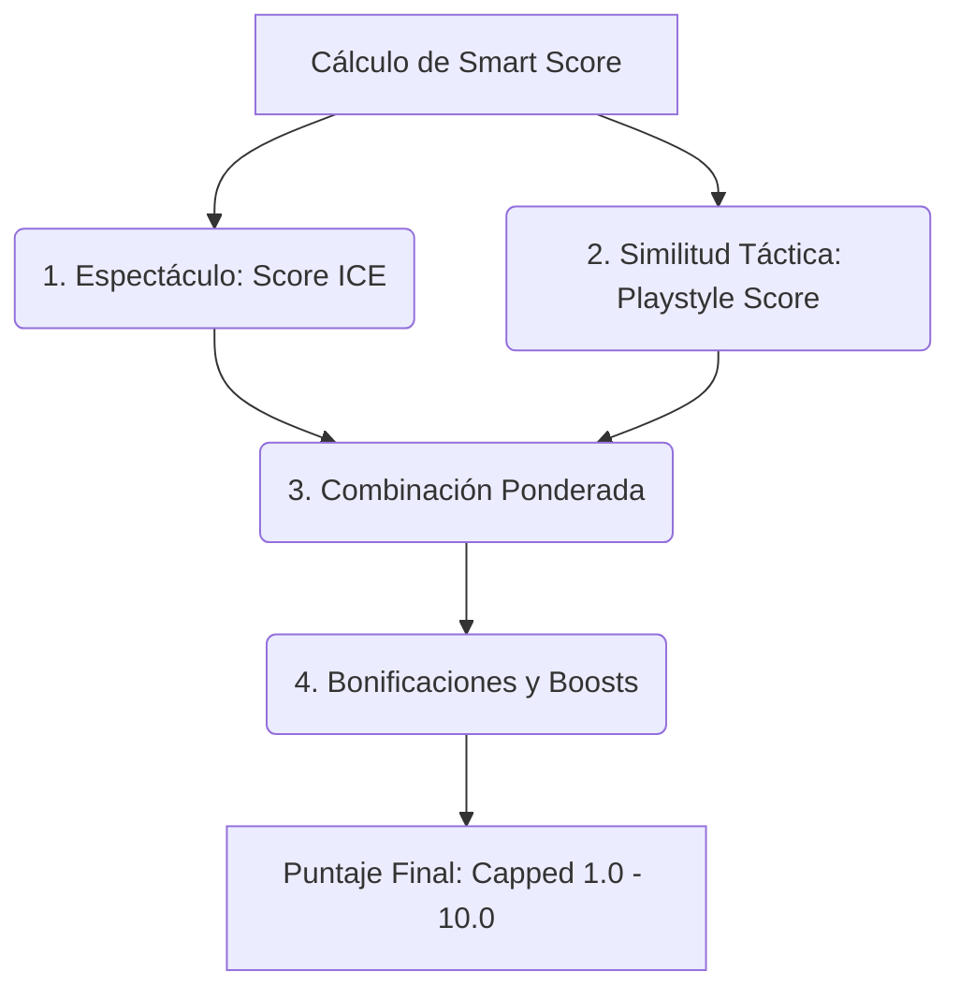

# Análisis del Sistema Recomendador (Smart Score)

El sistema recomendador de la aplicación **worldcup-app** se encarga de calcular un **"Smart Score"** (puntaje inteligente) personalizado para cada partido. Este puntaje oscila en el rango de `1.0` a `10.0` y representa la afinidad del partido para el usuario actual.

El cálculo se realiza en el archivo [scoring.js](file:///c:/Users/tomas/Desktop/proyectos/worldcup-app/frontend/js/scoring.js) a través de la función principal `calculateSmartScore(match, teams, tacticalVector)`.

---

## Estructura General del Algoritmo

El cálculo unifica dos componentes fundamentales (Espectáculo e Identidad Táctica), aplica ponderaciones parametrizables por el usuario y añade una serie de bonificaciones basadas en sus preferencias explícitas (favoritos, edad de la plantilla y test de afinidad).

---

## Paso a Paso del Algoritmo

### 1. Inicialización y Casos Especiales
* **Partidos por Definir (TBD):** Si uno o ambos equipos son placeholders (ej. "Ganador Grupo A"), se calcula y devuelve únicamente el score de espectáculo base (ICE) y se le asigna un score de estilo por defecto de `5.0`.
* **Falta de Datos:** Si no se encuentran métricas de alguno de los equipos en el dataset, el sistema actúa de forma análoga retornando la base de espectáculo.

### 2. Fase 1: Score de Espectáculo (ICE)
Calcula el Índice de Competitividad y Espectáculo objetivo del cruce:
* **Fusión de Métricas:** Promedia las métricas normalizadas de los contendientes (`ocasiones_norm`, `contra_norm`, `drama_norm`, `vuln_norm`).
* **Amplificación por Vulnerabilidad:** El peligro generado por ocasiones claras se escala según la debilidad defensiva promedio de ambos equipos.
* **Penalización por Brecha Competitiva ($p_{Brecha}$):** Aplica una curva sigmoide logística sobre la diferencia de sus Elo Ratings base (reduciendo hasta un 60% la valoración si el encuentro es muy disparejo).
* **Factor de Calidad Absoluta ($Q_{match}$):** Escala linealmente el score final basándose en el promedio de los Elo ratings dinámicos (que integran la presencia de estrellas convocadas).

### 3. Fase 2: Afinamiento por Estilo de Juego (Playstyle)
Compara el estilo preferido del usuario contra la propuesta táctica de los equipos:
* **Vectores de Entrada:** Vector del usuario ($V_U$) y vectores tácticos de ambos equipos ($V_A$, $V_B$).
* **Heurística del Protagonista:** El score táctico bruto prioriza al equipo que más se parece a los gustos del usuario, sumando el estilo del rival con un coeficiente de amortiguación ($\lambda = 0.1$):
  $$Score_{\text{Táctico Bruto}} = \max(Sim(V_A, V_U), Sim(V_B, V_U)) + 0.1 \cdot \min(Sim(V_A, V_U), Sim(V_B, V_U))$$
* **Proyección:** El resultado bruto de similitud coseno se escala linealmente desde el rango teórico $[-1.1, 1.1]$ a la escala estándar de $[1.0, 10.0]$.
* *Nota:* Si el usuario no ha especificado preferencias tácticas (vector neutro), el score de estilo iguala al score de espectáculo (ICE).

### 4. Fase 3: Fusión por Producto Escalar (Dot Product)
El recomendador formaliza la integración de todas las componentes como el producto punto de dos vectores: el Vector de Pesos del Usuario ($\mathbf{W}_U$) y el Vector de Características del Partido ($\mathbf{S}_M$).

#### 4.1. Normalización del Vector de Pesos del Usuario ($\mathbf{W}_U$)
El usuario asigna puntuaciones de `1 a 10` a las tres macro-componentes del recomendador en la interfaz. Para que la escala de recomendación permanezca consistente y dinámica, cada peso se divide por la suma total de los pesos **de las componentes activas**. La activación se modela mediante un vector binario de activación $\mathbf{M} \in \{0, 1\}^3$:
*   $M_{\text{espectáculo}} = 1$ (siempre activo).
*   $M_{\text{táctica}} = 1$ si el usuario ha realizado el test táctico y configuró un vector personalizado; $0$ si el vector táctico es neutro.
*   $M_{\text{afectivo}} = 1$ si el usuario ha configurado al menos un favorito (selecciones, clubes o jugadores); $0$ si no hay preferencias afectivas.

La normalización dinámica se define por:
$$w_{\text{sum}} = M_{\text{espectáculo}} \cdot w_{\text{espectáculo}} + M_{\text{táctica}} \cdot w_{\text{táctica}} + M_{\text{afectivo}} \cdot w_{\text{afectivo}}$$
$$\mathbf{W}_U = \left[ \frac{M_{\text{espectáculo}} \cdot w_{\text{espectáculo}}}{w_{\text{sum}}}, \frac{M_{\text{táctica}} \cdot w_{\text{táctica}}}{w_{\text{sum}}}, \frac{M_{\text{afectivo}} \cdot w_{\text{afectivo}}}{w_{\text{sum}}} \right]$$

*   *Propiedad de Consistencia:* Si un usuario no define equipos, jugadores o clubes favoritos, la dimensión afectiva completa se inactiva ($M_{\text{afectivo}} = 0$). De esta forma, el peso afectivo no diluye la puntuación y el score final del partido (determinado en este caso solo por el espectáculo y la táctica) puede alcanzar la escala máxima de `10.0` sin verse afectado por la ausencia de favoritos. Ocurre exactamente lo mismo con la táctica si no se ha completado el quiz táctico ($M_{\text{táctica}} = 0$).

#### 4.2. Calibración de Fricción Interna (dramaBeta)
La fricción física del partido (`dramaMatch`) es procesada como una dimensión interna de la variable Espectáculo (ICE) en lugar de actuar como un componente vector externo. Es calibrada mediante el slider de fricción (`dramaBeta`, de `0.0` a `0.6`):
*   Si se sitúa en `0.0`, el roce físico no ejerce influencia alguna en el espectáculo objetivo del encuentro.
*   La intensidad o dirección (juego limpio vs juego físico) es mapeada a través de `dramaBeta` como un multiplicador directo de la propensión física de las selecciones.

#### 4.3. Algoritmo Afectivo ($S_{\text{afectivo}}$)
El score afectivo del partido (rango `[0.0, 10.0]`) combina tres dimensiones lineales:
$$S_{\text{afectivo}} = (0.3 \cdot S_{\text{club}} + 0.4 \cdot S_{\text{sel}} + 0.3 \cdot S_{\text{jug}}) \times 10.0$$

1.  **Probabilidad de Juego Piecemeal ($P_{\text{juego}}$):** Para cada convocado, se estima su probabilidad esperada de jugar minutos:
    $$P_{\text{juego}}(i) = 
    \begin{cases} 
    \frac{\text{Minutos Jugados}_i}{\text{Partidos de Selección} \times 90} & \text{Si tiene minutos registrados en Eliminatorias / Copa Oro*} \\
    \\
    \frac{\text{Valor Mercado}_i}{\max(\text{Valor Mercado de su Selección})} & \text{Si es convocado con 0 minutos (Regreso de lesión o debutante)}
    \end{cases}$$
    *\*Los anfitriones USA, México y Canadá utilizan los minutos jugados en la Copa de Oro 2025.*
2.  **Atenuación Logarítmica de Clubes ($S_{\text{club}}$):** Suma las probabilidades de juego de convocados del club favorito y aplica la atenuación de rendimientos decrecientes con constante de control del torneo $Z_{\text{club}} = 5.0$:
    $$S_{\text{club}} = \frac{\log(1 + \sum P_{\text{juego}}(i))}{\log(1 + Z_{\text{club}})}$$
3.  **Selecciones Priorizadas ($S_{\text{sel}}$):** Permite hasta 4 selecciones favoritas en orden. El equipo principal recibe un peso $w_p = 0.70$ y los secundarios $w_m = 0.30$ cada uno:
    $$S_{\text{sel}} = w_p I_p + w_m n_m$$
4.  **Jugadores Similares en Espacio Latente ($S_{\text{jug}}$):** Suma las contribuciones de tus jugadores favoritos directos ($J_d$) más los jugadores similares detectados ($J_s$, el top 10 de vecinos más cercanos precalculados mediante $10$-NN sobre el espacio latente del PCA con $PC_1$):
    $$S_{\text{jug}} = \log(1 + J_d) + \lambda \log(1 + J_s)$$
    Donde $\lambda = 0.5$ (factor de peso para similares), e $J_d$ y $J_s$ acumulan el impacto ponderado de sus probabilidades de juego y, en el caso de $J_s$, la afinidad inversa por distancia:
    *   $J_d = \sum_{i \in \text{Directos}} P_{\text{juego}}(i)$
    *   $J_s = \sum_{j \in \text{Similares}} w_j P_{\text{juego}}(j)$
    
    La afinidad de cada jugador similar decae proporcionalmente a su distancia euclidiana en el espacio latente mediante decaimiento inverso (evitando colapsos con un suavizado $\epsilon = 0.1$):
    $$w_j = \frac{1}{d_j + \epsilon}$$

#### 4.4. Cálculo del Score Final
$$SmartScore = w_{\text{esp\_norm}} S_{\text{espectáculo}} + w_{\text{tác\_norm}} S_{\text{táctica}} + w_{\text{afec\_norm}} S_{\text{afectivo}}$$
El valor resultante se acota estrictamente en el intervalo `[1.0, 10.0]` y se redondea a un decimal.

---

## Datos Utilizados por el Algoritmo (`scoring.js`)

Si necesitas depurar o calibrar el recomendador, estas son las propiedades consumidas de las estructuras principales:

### Datos de Equipos y Plantillas (`teams`)
* `team.metrics.elo_rating`: Puntuación Elo base del equipo.
* `team.espectaculo_params`: Objeto que contiene las métricas precalculadas en la base de datos (`ocasiones_norm`, `contra_norm`, `drama_norm`, `vuln_norm`).
* `team.tactical_vector`: Vector táctico 4D del equipo (`defensa`, `posesion`, `ritmo`, `ancho`).
* `team.squad`: Lista de convocados. Cada jugador posee:
  * `player.name` (Nombre para coincidencia Unicode robusta)
  * `player.club` (Club de pertenencia)
  * `player.market_value_eur` (Valor de mercado)
  * `player.minutes_recent` (Minutos oficiales en clasificatorias/Copa Oro)
  * `player.is_star_player` (Booleano de crack destacado)

### Preferencias del Usuario (`state.userPreferences`)
* `w_espectaculo`, `w_tactica`, `w_afectivo`, `w_friccion`: Pesos macro del usuario (1 a 10).
* `favoriteTeams`: Array de códigos FIFA de las selecciones favoritas (máximo 4, el primero es prioritario).
* `favoritePlayers`: Array de strings con nombres de jugadores favoritos.
* `favoriteClubs`: Array de strings con nombres de clubes favoritos.
* `friccionGusto`: Selector de gusto por juego físico (1) o juego limpio (0).
* `tacticalVector`: Vector táctico ideal resultante del test/quiz.
