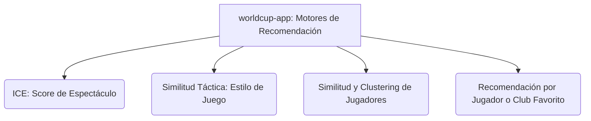

# Guía Maestra de Scores y Recomendaciones

Esta guía consolidada describe a grandes rasgos el funcionamiento de los distintos **scores**, **vectores de estilo** y **clústeres de similitud** que utiliza la aplicación `worldcup-app`. 

Aquí se detalla el propósito de cada score, qué scripts y bases de datos lo sustentan, y en qué archivos de documentación se profundiza cada metodología.

---

## Índice General de Modelos de Scores

---

## 1. Índice de Competitividad y Espectáculo (ICE)

* **Propósito:** Predecir cuán atractivo o emocionante será un cruce entre dos selecciones en tiempo real (por ejemplo, en el simulador o fixture). Evita evaluar la cantidad simple de goles a favor de métricas dinámicas de generación de peligro.
* **Métricas de Entrada:** Ocasiones Claras, Contraataques, Drama (Faltas/Tarjetas) y Vulnerabilidad (Goles Concedidos).
* **Filtros e Inferencia Clave:**
  * **Alineación de Medias:** Normaliza las estadísticas para evitar la inflación artificial de selecciones en confederaciones de menor nivel (como la OFC) frente a confederaciones sumamente competitivas (como CONMEBOL o UEFA).
  * **Coeficiente de Dificultad ($C_{dif}$):** Ajusta las métricas individuales según la jerarquía de los rivales históricos de eliminatoria basándose en el ranking FIFA, premiando a los que enfrentaron un calendario difícil.
  * **Penalización por Brecha de ELO:** Reduce el score final en partidos muy disparejos (donde la brecha de ELO es alta) debido a la falta de tensión competitiva.
* **Componentes del Proyecto:**
  * Documentación detallada: [score_espectaculo.md](file:///c:/Users/tomas/Desktop/proyectos/worldcup-app/documentacion/score_espectaculo.md)
  * Script de cálculo y almacenamiento en base de datos: [calculate_score_espectaculo.py](file:///c:/Users/tomas/Desktop/proyectos/worldcup-app/scripts/calculate_score_espectaculo.py)
  * Cálculo dinámico (Frontend): [scoring.js](file:///c:/Users/tomas/Desktop/proyectos/worldcup-app/frontend/js/scoring.js)
  * Datos guardados en: Tabla `scraped_team_metrics` en [worldcup_combined.db](file:///c:/Users/tomas/Desktop/proyectos/worldcup-app/data/worldcup_combined.db) (`ocasiones_norm`, `contra_norm`, `drama_norm`, `vuln_norm`).

---

## 2. Similitud Táctica (Estilo de Juego de Selecciones)

* **Propósito:** Comparar de manera transparente la propuesta táctica de cada selección nacional contra las preferencias de estilo del usuario (o de otros equipos).
* **El Vector Táctico de 4 Dimensiones:** Cada equipo se mapea a un vector $V = [d, p, r, a]$ en el rango $[-1.0, 1.0]$:
  1. **Fase Defensiva ($d$):** Bloque bajo/repliegue vs. Presión alta activa.
  2. **Fase de Posesión ($p$):** Transiciones directas vs. Elaboración asociativa (*Tiki-Taka*).
  3. **Ritmo de Juego ($r$):** Circulación pausada/control vs. Transiciones verticales rápidas.
  4. **Uso del Ancho de Campo ($a$):** Juego interior por el centro vs. Explotación de bandas y amplitud.
* **Heurística del "Protagonista":** Al calcular el score táctico de un cruce directo, la fórmula otorga prioridad al equipo que más se acerca a la preferencia de estilo del usuario, aplicando una amortiguación ($\lambda = 0.1$) al estilo del oponente. Esto evita penalizar partidos donde un solo equipo propone el arquetipo buscado.
* **Normalización No Lineal:** Utiliza Z-Score con proyección de tangente hiperbólica ($\tanh$) para evitar que los valores atípicos (outliers) distorsionen la escala.
* **Componentes del Proyecto:**
  * Documentación detallada: [score_estilo_de_juego.md](file:///c:/Users/tomas/Desktop/proyectos/worldcup-app/documentacion/score_estilo_de_juego.md)
  * Script de actualización: [update_tactical_vectors.py](file:///c:/Users/tomas/Desktop/proyectos/worldcup-app/scripts/update_tactical_vectors.py)
  * Datos guardados en: JSON de estilos [selecciones_estilo](file:///c:/Users/tomas/Desktop/proyectos/worldcup-app/data/estilos-de-juego/selecciones_estilo).

---

## 3. Similitud y Clustering de Jugadores (Arquetipos)

* **Propósito:** Clasificar a todos los jugadores oficialmente convocados al Mundial en roles y estilos de juego específicos (arquetipos) basándose en más de 40 atributos físicos y técnicos del videojuego EA Sports FC 26.
* **Metodología y Procesamiento:**
  * **Ingesta y Limpieza:** Mapea el dataset de EA FC 26 con la base de datos de convocados mundialistas aplicando normalización Unicode para resolver acentos y caracteres especiales.
  * **Optimización de $K$ (Silhouette Score):** El sistema calcula dinámicamente el número óptimo de clústeres para cada categoría táctica (Arqueros, Centrales, Laterales, Volantes, Extremos, Delanteros).
  * **Estandarización y Reducción por PCA (Método B):** Incorpora el peso (`weight_kg`) y la altura (`height_cm`), estandariza usando `StandardScaler` (z-score) y aplica un análisis PCA para retener el $\ge 80\%$ de varianza explicada.
  * **Supresión de PC1 (Ignorar Calidad):** Para evitar que el algoritmo clasifique a los jugadores por "buenos" o "malos", se descarta la primera componente principal (PC1), la cual correlaciona en un $>88\%$ con la calidad general (`overall`). KMeans opera únicamente sobre las componentes restantes (PC2 a PCN), agrupándolos exclusivamente por estilo y rol táctico.
  * **Optimización de $K$ (Silhouette Score):** Se optimiza dinámicamente el número de clusters para cada posición, asegurando clusters de tamaño consistente ($>10$ jugadores) y forzando $K=4$ para los mediocampistas.
* **Grupos y Arquetipos Deducidos:**
  * **Goalkeepers (K=3):** Representados por Alisson (89), Kobel (86) y Courtois (89).
  * **Centerbacks (K=3):** Representados por Gabriel Magalhães (88), Virgil van Dijk (90) y Jonathan Tah (87).
  * **Fullbacks (K=3):** Representados por Achraf Hakimi (89), Jules Koundé (87) y Nuno Mendes (86).
  * **Midfielders (K=4):** Representados por Joshua Kimmich (89 - *Organizadores*), Rodri (90 - *Pivotes Físicos*), Florian Wirtz (89 - *Mediapuntas*) y Jude Bellingham (90 - *Box-to-box*).
  * **Strikers (K=3):** Representados por Harry Kane (89), Ousmane Dembélé (90) y Kylian Mbappé (91).
  * **Wingers (K=3):** Representados por Raphinha (89), Bukayo Saka (88) y Mohamed Salah (91).
* **Componentes del Proyecto:**
  * Documentación teórica: [score_jugadores_perfil_clusters.md](file:///c:/Users/tomas/Desktop/proyectos/worldcup-app/documentacion/score_jugadores_perfil_clusters.md)
  * Perfiles específicos y desviaciones estadísticas: [score_jugadores_perfil_clusters.md](file:///c:/Users/tomas/Desktop/proyectos/worldcup-app/documentacion/score_jugadores_perfil_clusters.md)
  * Scripts del Pipeline: [scrapping_clustering.py](file:///c:/Users/tomas/Desktop/proyectos/worldcup-app/data/clustering_players/scrapping_clustering.py) (Ingesta), [HAC_clustering.py](file:///c:/Users/tomas/Desktop/proyectos/worldcup-app/scripts/recommender/HAC_clustering.py) (Motor) y [cluster_profiling.py](file:///c:/Users/tomas/Desktop/proyectos/worldcup-app/scripts/recommender/cluster_profiling.py) (Generador del Reporte de Perfiles).

---

## 4. Recomendador por Jugador o Club Favorito

* **Propósito:** Recomendar al usuario partidos de interés según sus preferencias afectivas.
* **Lógica del Recomendador:**
  * **Por Jugador Favorito:** Calcula los 5 jugadores más similares a su preferido usando distancia coseno sobre atributos estandarizados. Recomienda encuentros en los que participen el jugador favorito o sus similares, calculando un score proporcional a la similitud coseno y normalizado exponencialmente.
  * **Por Club Favorito:** Consulta la base de datos de convocados SQLite para buscar qué futbolistas pertenecen al club de preferencia del usuario y calcula la proporción en la que están distribuidos en las selecciones de cada encuentro.
* **Componentes del Proyecto:**
  * Documentación detallada: [sistema_recomendador.md](file:///c:/Users/tomas/Desktop/proyectos/worldcup-app/documentacion/sistema_recomendador.md) y [analisis_recomendador.md](file:///c:/Users/tomas/Desktop/proyectos/worldcup-app/documentacion/analisis_recomendador.md)
  * Scripts del Motor: [recommend_similar_players.py](file:///c:/Users/tomas/Desktop/proyectos/worldcup-app/scripts/recommender/recommend_similar_players.py), [recommend_matches_by_players.py](file:///c:/Users/tomas/Desktop/proyectos/worldcup-app/scripts/recommender/recommend_matches_by_players.py) y [recommend_matches_by_team.py](file:///c:/Users/tomas/Desktop/proyectos/worldcup-app/scripts/recommender/recommend_matches_by_team.py).
  * Base de datos de convocados: [convocados.db](file:///c:/Users/tomas/Desktop/proyectos/worldcup-app/data/recommender_data/convocados.db) (generada a partir de [Lista de Convocados.md](file:///c:/Users/tomas/Desktop/proyectos/worldcup-app/Lista%20de%20Convocados.md) mediante el script [parse_convocados.py](file:///c:/Users/tomas/Desktop/proyectos/worldcup-app/scripts/recommender/parse_convocados.py)).

---
*Preparado para el proyecto `worldcup-app` — Junio 2026*
