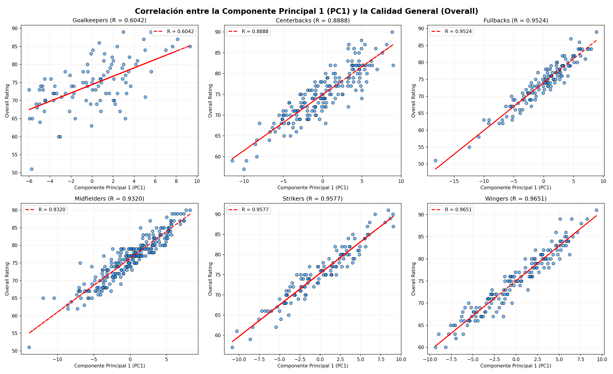

# Reporte de Clusters y Estadísticas Diferenciadoras (Datos Crudos) - Método B (Sin PC1)

Este reporte analiza empíricamente los clústeres generados mediante **KMeans (Método B)** con optimización dinámica de K (forzando K=4 para mediocampistas).
Este método utiliza `StandardScaler` + `PCA` (excluyendo la primera componente principal `PC1`) para agrupar por estilo de juego puro sin el sesgo de la calidad general (`overall`).

## Justificación de la Exclusión de PC1 (Calidad vs. Estilo)
Al realizar el análisis de componentes principales (PCA) sobre las estadísticas de los jugadores en cada posición, se observa que la primera componente principal (PC1) captura la dirección de máxima varianza, la cual coincide casi en su totalidad con el nivel general del jugador (`overall`).

Para demostrar esta fuerte relación, se calculó la correlación de Pearson ($R$) entre PC1 y el `overall` para todas las posiciones:
- **Goalkeepers**: $R = 0.6042$
- **Centerbacks**: $R = 0.8888$
- **Fullbacks**: $R = 0.9524$
- **Midfielders**: $R = 0.9320$
- **Strikers**: $R = 0.9577$
- **Wingers**: $R = 0.9651$

Como se observa en el gráfico de correlación, a excepción de los arqueros (donde la correlación es moderadamente alta), para todos los jugadores de campo la correlación es extremadamente alta ($> 0.88$). Si mantuviéramos PC1 en el clustering, el algoritmo agruparía a los jugadores principalmente por su nivel de habilidad general ("buenos" vs "malos") en lugar de por su estilo de juego y rol táctico. Al descartar PC1, el clustering opera sobre las componentes PC2 a PCN, agrupando a los futbolistas por sus perfiles estilísticos de forma pura.

## Comparación de Cohesión: Método Anterior vs. Método B
Al migrar del método anterior (MaxAbsScaler + L2 norm sobre todas las dimensiones) al **Método B** (StandardScaler + PCA sin PC1), el **Silhouette Score** mejoró notablemente en todas las posiciones, lo que indica clústeres mucho más definidos y compactos:

| Posición | K | Silhouette (Método Anterior) | Silhouette (Método B) | Incremento de Cohesión |
| :--- | :---: | :---: | :---: | :---: |
| 🧤 **Goalkeepers** | 3 | 0.0955 | 0.1295 | **+35.6%** |
| 🛡️ **Centerbacks** | 3 | 0.1682 | 0.1876 | **+11.5%** |
| 🏃‍♂️ **Fullbacks** | 4 | 0.1391 | 0.1979 | **+42.3%** |
| 🧠 **Midfielders** | 4 | 0.1591 | 0.2268 | **+42.6%** |
| ⚽ **Strikers** | 3 | 0.1886 | 0.2261 | **+19.9%** |
| ⚡ **Wingers** | 3 | 0.1577 | 0.2410 | **+52.8%** |

---

## Goalkeepers (KMeans Arquetipos >75)
Total jugadores analizados: 97

| Clúster | Representante principal | Miembros | Atributos Destacados (Desviación vs Mediana Global) |
| :--- | :--- | :---: | :--- |
| Cluster 1: **Arquero Distribuidor / Ball-Playing** | Ederson Santana de Moraes (85) | 7 | **+28** en skill long passing, **+21** en attacking short passing, **+19** en skill ball control, **+19** en mentality vision, **+15** en mentality composure |
| Cluster 2: **Arquero Físico / Shot-stopper Clásico** | Thibaut Nicolas Marc Courtois (89) | 51 | **+3** en attacking finishing, **+3** en attacking volleys, **+3** en mentality penalties, **+2** en mentality positioning, **+2** en power long shots |
| Cluster 3: **Arquero Líbero / Sweeper Keeper** | Alisson Ramsés Becker (89) | 39 | **+7** en attacking short passing, **+7** en skill long passing, **+7** en mentality composure, **+5** en skill ball control, **+5** en movement acceleration |

### Análisis Detallado de Arquetipos por Clúster

#### Clúster 1: **"Arquero Distribuidor / Ball-Playing"** (Representante: Ederson Santana de Moraes - 85)
- **Tamaño del grupo:** 7 jugadores.
- **Ejemplos en el dataset:** Ederson Santana de Moraes, Manuel Peter Neuer, Jordan Lee Pickford, Dominik Kotarski, Matěj Kovář, Mike Louis Penders

##### Fortalezas del Arquetipo (Desviación Positiva vs Mediana Global):
  * **Skill Long Passing**: ++28.0 (Mediana del clúster: 61.0 vs Mediana global: 33.0)
  * **Attacking Short Passing**: ++21.0 (Mediana del clúster: 55.0 vs Mediana global: 34.0)
  * **Skill Ball Control**: ++19.0 (Mediana del clúster: 42.0 vs Mediana global: 23.0)
  * **Mentality Vision**: ++19.0 (Mediana del clúster: 66.0 vs Mediana global: 47.0)
  * **Mentality Composure**: ++15.0 (Mediana del clúster: 63.0 vs Mediana global: 48.0)

##### Carencias del Arquetipo (Desviación Negativa vs Mediana Global):
  * **Movement Acceleration**: -7.0 (Mediana del clúster: 34.0 vs Mediana global: 41.0)
  * **Movement Sprint Speed**: -6.0 (Mediana del clúster: 37.0 vs Mediana global: 43.0)
  * **Defending Sliding Tackle**: -3.0 (Mediana del clúster: 10.0 vs Mediana global: 13.0)
  * **Power Long Shots**: -2.0 (Mediana del clúster: 9.0 vs Mediana global: 11.0)
  * **Attacking Finishing**: -1.0 (Mediana del clúster: 9.0 vs Mediana global: 10.0)

________________________________________

#### Clúster 2: **"Arquero Físico / Shot-stopper Clásico"** (Representante: Thibaut Nicolas Marc Courtois - 89)
- **Tamaño del grupo:** 51 jugadores.
- **Ejemplos en el dataset:** Thibaut Nicolas Marc Courtois, Unai Simón Mendibil, Gerónimo Rulli, Yassine Bounouياسين بونو, Rui Tiago Dantas da Silva, Uğurcan Çakır

##### Fortalezas del Arquetipo (Desviación Positiva vs Mediana Global):
  * **Attacking Finishing**: ++3.0 (Mediana del clúster: 13.0 vs Mediana global: 10.0)
  * **Attacking Volleys**: ++3.0 (Mediana del clúster: 13.0 vs Mediana global: 10.0)
  * **Mentality Penalties**: ++3.0 (Mediana del clúster: 19.0 vs Mediana global: 16.0)
  * **Mentality Positioning**: ++2.0 (Mediana del clúster: 12.0 vs Mediana global: 10.0)
  * **Power Long Shots**: ++2.0 (Mediana del clúster: 13.0 vs Mediana global: 11.0)

##### Carencias del Arquetipo (Desviación Negativa vs Mediana Global):
  * **Mentality Composure**: -8.0 (Mediana del clúster: 40.0 vs Mediana global: 48.0)
  * **Skill Long Passing**: -7.0 (Mediana del clúster: 26.0 vs Mediana global: 33.0)
  * **Attacking Short Passing**: -6.0 (Mediana del clúster: 28.0 vs Mediana global: 34.0)
  * **Mentality Vision**: -5.0 (Mediana del clúster: 42.0 vs Mediana global: 47.0)
  * **Skill Ball Control**: -4.0 (Mediana del clúster: 19.0 vs Mediana global: 23.0)

________________________________________

#### Clúster 3: **"Arquero Líbero / Sweeper Keeper"** (Representante: Alisson Ramsés Becker - 89)
- **Tamaño del grupo:** 39 jugadores.
- **Ejemplos en el dataset:** Alisson Ramsés Becker, Mike Peterson Maignan, David Raya Martín, Gregor Kobel, Damián Emiliano Martínez Romero, Diogo Meireles da Costa

##### Fortalezas del Arquetipo (Desviación Positiva vs Mediana Global):
  * **Attacking Short Passing**: ++7.0 (Mediana del clúster: 41.0 vs Mediana global: 34.0)
  * **Skill Long Passing**: ++7.0 (Mediana del clúster: 40.0 vs Mediana global: 33.0)
  * **Mentality Composure**: ++7.0 (Mediana del clúster: 55.0 vs Mediana global: 48.0)
  * **Skill Ball Control**: ++5.0 (Mediana del clúster: 28.0 vs Mediana global: 23.0)
  * **Movement Acceleration**: ++5.0 (Mediana del clúster: 46.0 vs Mediana global: 41.0)

##### Carencias del Arquetipo (Desviación Negativa vs Mediana Global):
  * **Attacking Finishing**: -2.0 (Mediana del clúster: 8.0 vs Mediana global: 10.0)
  * **Power Long Shots**: -2.0 (Mediana del clúster: 9.0 vs Mediana global: 11.0)
  * **Mentality Positioning**: -2.0 (Mediana del clúster: 8.0 vs Mediana global: 10.0)
  * **Attacking Heading Accuracy**: -1.0 (Mediana del clúster: 13.0 vs Mediana global: 14.0)
  * **Skill Curve**: -1.0 (Mediana del clúster: 13.0 vs Mediana global: 14.0)

________________________________________

---

## Centerbacks (KMeans Arquetipos >75)
Total jugadores analizados: 184

| Clúster | Representante principal | Miembros | Atributos Destacados (Desviación vs Mediana Global) |
| :--- | :--- | :---: | :--- |
| Cluster 1: **Central de Cobertura / Corrector** | Marcos Aoás Corrêa (87) | 81 | **+5** en pace, **+5** en skill dribbling, **+4** en movement acceleration, **+4** en movement sprint speed, **+3** en dribbling |
| Cluster 2: **Central Físico / Stopper** | Virgil van Dijk (90) | 51 | **+6** en mentality aggression, **+4** en power strength, **+3** en power shot power, **+3** en mentality interceptions, **+3** en physic |
| Cluster 3: **Central Creador / Líbero Técnico** | Nathan Benjamin Aké (83) | 52 | **+10** en attacking crossing, **+10** en attacking finishing, **+9** en power long shots, **+8** en attacking volleys, **+8** en skill curve |

### Análisis Detallado de Arquetipos por Clúster

#### Clúster 1: **"Central de Cobertura / Corrector"** (Representante: Marcos Aoás Corrêa - 87)
- **Tamaño del grupo:** 81 jugadores.
- **Ejemplos en el dataset:** Marcos Aoás Corrêa, Nico Cedric Schlotterbeck, Dayotchanculle Oswald Upamecano, Piero Martín Hincapié Reyna, Micky van de Ven, Addji Keaninkin Marc-Israel Guéhi

##### Fortalezas del Arquetipo (Desviación Positiva vs Mediana Global):
  * **Pace**: ++5.5 (Mediana del clúster: 73.0 vs Mediana global: 67.5)
  * **Skill Dribbling**: ++5.0 (Mediana del clúster: 64.0 vs Mediana global: 59.0)
  * **Movement Acceleration**: ++4.0 (Mediana del clúster: 68.0 vs Mediana global: 64.0)
  * **Movement Sprint Speed**: ++4.0 (Mediana del clúster: 74.0 vs Mediana global: 70.0)
  * **Dribbling**: ++3.0 (Mediana del clúster: 66.0 vs Mediana global: 63.0)

##### Carencias del Arquetipo (Desviación Negativa vs Mediana Global):
  * **Mentality Positioning**: -4.0 (Mediana del clúster: 40.0 vs Mediana global: 44.0)
  * **Power Shot Power**: -2.5 (Mediana del clúster: 52.0 vs Mediana global: 54.5)
  * **Power Long Shots**: -2.5 (Mediana del clúster: 35.0 vs Mediana global: 37.5)
  * **Attacking Volleys**: -2.0 (Mediana del clúster: 31.0 vs Mediana global: 33.0)
  * **Skill Fk Accuracy**: -2.0 (Mediana del clúster: 31.0 vs Mediana global: 33.0)

________________________________________

#### Clúster 2: **"Central Físico / Stopper"** (Representante: Virgil van Dijk - 90)
- **Tamaño del grupo:** 51 jugadores.
- **Ejemplos en el dataset:** Virgil van Dijk, Gabriel dos Santos Magalhães, Jonathan Glao Tah, William Alain André Gabriel Saliba, Antonio Rüdiger, Ibrahima Konaté

##### Fortalezas del Arquetipo (Desviación Positiva vs Mediana Global):
  * **Mentality Aggression**: ++6.0 (Mediana del clúster: 82.0 vs Mediana global: 76.0)
  * **Power Strength**: ++4.0 (Mediana del clúster: 85.0 vs Mediana global: 81.0)
  * **Power Shot Power**: ++3.5 (Mediana del clúster: 58.0 vs Mediana global: 54.5)
  * **Mentality Interceptions**: ++3.0 (Mediana del clúster: 77.0 vs Mediana global: 74.0)
  * **Physic**: ++3.0 (Mediana del clúster: 81.0 vs Mediana global: 78.0)

##### Carencias del Arquetipo (Desviación Negativa vs Mediana Global):
  * **Movement Balance**: -9.0 (Mediana del clúster: 49.0 vs Mediana global: 58.0)
  * **Movement Agility**: -8.0 (Mediana del clúster: 52.0 vs Mediana global: 60.0)
  * **Mentality Positioning**: -8.0 (Mediana del clúster: 36.0 vs Mediana global: 44.0)
  * **Power Long Shots**: -7.5 (Mediana del clúster: 30.0 vs Mediana global: 37.5)
  * **Attacking Crossing**: -6.5 (Mediana del clúster: 39.0 vs Mediana global: 45.5)

________________________________________

#### Clúster 3: **"Central Creador / Líbero Técnico"** (Representante: Nathan Benjamin Aké - 83)
- **Tamaño del grupo:** 52 jugadores.
- **Ejemplos en el dataset:** Nathan Benjamin Aké, David Olatukunbo Alaba, Nicolás Hernán Gonzalo Otamendi, John Stones, Aymeric Jean Louis Gerard Alphonse Laporte, Lucas François Bernard Hernández Pi

##### Fortalezas del Arquetipo (Desviación Positiva vs Mediana Global):
  * **Attacking Crossing**: ++10.5 (Mediana del clúster: 56.0 vs Mediana global: 45.5)
  * **Attacking Finishing**: ++10.0 (Mediana del clúster: 45.0 vs Mediana global: 35.0)
  * **Power Long Shots**: ++9.0 (Mediana del clúster: 46.5 vs Mediana global: 37.5)
  * **Attacking Volleys**: ++8.5 (Mediana del clúster: 41.5 vs Mediana global: 33.0)
  * **Skill Curve**: ++8.5 (Mediana del clúster: 51.5 vs Mediana global: 43.0)

##### Carencias del Arquetipo (Desviación Negativa vs Mediana Global):
  * **Pace**: -6.5 (Mediana del clúster: 61.0 vs Mediana global: 67.5)
  * **Power Jumping**: -6.5 (Mediana del clúster: 75.5 vs Mediana global: 82.0)
  * **Movement Sprint Speed**: -6.0 (Mediana del clúster: 64.0 vs Mediana global: 70.0)
  * **Defending Marking Awareness**: -4.5 (Mediana del clúster: 70.5 vs Mediana global: 75.0)
  * **Defending Sliding Tackle**: -4.0 (Mediana del clúster: 70.0 vs Mediana global: 74.0)

________________________________________

---

## Fullbacks (KMeans Arquetipos >75)
Total jugadores analizados: 133

| Clúster | Representante principal | Miembros | Atributos Destacados (Desviación vs Mediana Global) |
| :--- | :--- | :---: | :--- |
| Cluster 1: **Lateral Físico / Centralizado** | Joško Gvardiol (84) | 37 | **+5** en attacking heading accuracy, **+3** en power strength, **+2** en defending, **+1** en attacking volleys, **+1** en mentality aggression |
| Cluster 2: **Lateral Invertido / Organizador** | Marc Cucurella Saseta (84) | 37 | **+9** en skill fk accuracy, **+5** en movement balance, **+4** en movement agility, **+3** en movement reactions, **+3** en dribbling |
| Cluster 3: **Carrilero Largo / Profundo** | Achraf Hakimi Mouhأشرف حكيمي (89) | 46 | **+6** en movement sprint speed, **+5** en attacking finishing, **+5** en pace, **+4** en movement acceleration, **+4** en shooting |
| Cluster 4: **Lateral de Contención** | Jules Olivier Koundé (87) | 13 | **+7** en mentality composure, **+7** en movement acceleration, **+6** en pace, **+6** en movement reactions, **+6** en movement sprint speed |

### Análisis Detallado de Arquetipos por Clúster

#### Clúster 1: **"Lateral Físico / Centralizado"** (Representante: Joško Gvardiol - 84)
- **Tamaño del grupo:** 37 jugadores.
- **Ejemplos en el dataset:** Joško Gvardiol, Denzel Justus Morris Dumfries, Reece James, Daniel Muñoz Mejía, Stefan Posch, Ramy Bensebainiرامي بن سبعيني

##### Fortalezas del Arquetipo (Desviación Positiva vs Mediana Global):
  * **Attacking Heading Accuracy**: ++5.0 (Mediana del clúster: 68.0 vs Mediana global: 63.0)
  * **Power Strength**: ++3.0 (Mediana del clúster: 74.0 vs Mediana global: 71.0)
  * **Defending**: ++2.0 (Mediana del clúster: 72.0 vs Mediana global: 70.0)
  * **Attacking Volleys**: ++1.0 (Mediana del clúster: 49.0 vs Mediana global: 48.0)
  * **Mentality Aggression**: ++1.0 (Mediana del clúster: 73.0 vs Mediana global: 72.0)

##### Carencias del Arquetipo (Desviación Negativa vs Mediana Global):
  * **Movement Agility**: -9.0 (Mediana del clúster: 66.0 vs Mediana global: 75.0)
  * **Movement Acceleration**: -8.0 (Mediana del clúster: 70.0 vs Mediana global: 78.0)
  * **Pace**: -7.0 (Mediana del clúster: 71.0 vs Mediana global: 78.0)
  * **Movement Sprint Speed**: -6.0 (Mediana del clúster: 72.0 vs Mediana global: 78.0)
  * **Movement Balance**: -6.0 (Mediana del clúster: 67.0 vs Mediana global: 73.0)

________________________________________

#### Clúster 2: **"Lateral Invertido / Organizador"** (Representante: Marc Cucurella Saseta - 84)
- **Tamaño del grupo:** 37 jugadores.
- **Ejemplos en el dataset:** Marc Cucurella Saseta, João Pedro Cavaco Cancelo, Pedro Antonio Porro Sauceda, Andrew Henry Robertson, Konrad Laimer, Lucas Digne

##### Fortalezas del Arquetipo (Desviación Positiva vs Mediana Global):
  * **Skill Fk Accuracy**: ++9.0 (Mediana del clúster: 56.0 vs Mediana global: 47.0)
  * **Movement Balance**: ++5.0 (Mediana del clúster: 78.0 vs Mediana global: 73.0)
  * **Movement Agility**: ++4.0 (Mediana del clúster: 79.0 vs Mediana global: 75.0)
  * **Movement Reactions**: ++3.0 (Mediana del clúster: 75.0 vs Mediana global: 72.0)
  * **Dribbling**: ++3.0 (Mediana del clúster: 75.0 vs Mediana global: 72.0)

##### Carencias del Arquetipo (Desviación Negativa vs Mediana Global):
  * **Power Jumping**: -6.0 (Mediana del clúster: 71.0 vs Mediana global: 77.0)
  * **Attacking Heading Accuracy**: -5.0 (Mediana del clúster: 58.0 vs Mediana global: 63.0)
  * **Power Strength**: -4.0 (Mediana del clúster: 67.0 vs Mediana global: 71.0)
  * **Physic**: -3.0 (Mediana del clúster: 71.0 vs Mediana global: 74.0)
  * **Movement Sprint Speed**: -3.0 (Mediana del clúster: 75.0 vs Mediana global: 78.0)

________________________________________

#### Clúster 3: **"Carrilero Largo / Profundo"** (Representante: Achraf Hakimi Mouhأشرف حكيمي - 89)
- **Tamaño del grupo:** 46 jugadores.
- **Ejemplos en el dataset:** Achraf Hakimi Mouhأشرف حكيمي, Nuno Alexandre Tavares Mendes, Theo Bernard François Hernández, Marcos Llorente Moreno, Alphonso Boyle Davies, David Raum

##### Fortalezas del Arquetipo (Desviación Positiva vs Mediana Global):
  * **Movement Sprint Speed**: ++6.0 (Mediana del clúster: 84.0 vs Mediana global: 78.0)
  * **Attacking Finishing**: ++5.0 (Mediana del clúster: 58.0 vs Mediana global: 53.0)
  * **Pace**: ++5.0 (Mediana del clúster: 83.0 vs Mediana global: 78.0)
  * **Movement Acceleration**: ++4.0 (Mediana del clúster: 82.0 vs Mediana global: 78.0)
  * **Shooting**: ++4.0 (Mediana del clúster: 60.0 vs Mediana global: 56.0)

##### Carencias del Arquetipo (Desviación Negativa vs Mediana Global):
  * **Defending Marking Awareness**: -3.0 (Mediana del clúster: 67.0 vs Mediana global: 70.0)
  * **Defending Standing Tackle**: -3.0 (Mediana del clúster: 70.0 vs Mediana global: 73.0)
  * **Defending Sliding Tackle**: -3.0 (Mediana del clúster: 69.0 vs Mediana global: 72.0)
  * **Mentality Interceptions**: -3.0 (Mediana del clúster: 68.0 vs Mediana global: 71.0)
  * **Attacking Short Passing**: -2.5 (Mediana del clúster: 70.5 vs Mediana global: 73.0)

________________________________________

#### Clúster 4: **"Lateral de Contención"** (Representante: Jules Olivier Koundé - 87)
- **Tamaño del grupo:** 13 jugadores.
- **Ejemplos en el dataset:** Jules Olivier Koundé, Jurriën David Norman Timber, Antonee Robinson, Rayan Aït Nouriريان آيت نوري, Valentino Francisco Livramento, Aaron Wan-Bissaka

##### Fortalezas del Arquetipo (Desviación Positiva vs Mediana Global):
  * **Mentality Composure**: ++7.0 (Mediana del clúster: 78.0 vs Mediana global: 71.0)
  * **Movement Acceleration**: ++7.0 (Mediana del clúster: 85.0 vs Mediana global: 78.0)
  * **Pace**: ++6.0 (Mediana del clúster: 84.0 vs Mediana global: 78.0)
  * **Movement Reactions**: ++6.0 (Mediana del clúster: 78.0 vs Mediana global: 72.0)
  * **Movement Sprint Speed**: ++6.0 (Mediana del clúster: 84.0 vs Mediana global: 78.0)

##### Carencias del Arquetipo (Desviación Negativa vs Mediana Global):
  * **Attacking Finishing**: -12.0 (Mediana del clúster: 41.0 vs Mediana global: 53.0)
  * **Power Long Shots**: -11.0 (Mediana del clúster: 45.0 vs Mediana global: 56.0)
  * **Power Shot Power**: -10.0 (Mediana del clúster: 55.0 vs Mediana global: 65.0)
  * **Shooting**: -10.0 (Mediana del clúster: 46.0 vs Mediana global: 56.0)
  * **Attacking Volleys**: -9.0 (Mediana del clúster: 39.0 vs Mediana global: 48.0)

________________________________________

---

## Midfielders (KMeans Arquetipos >75)
Total jugadores analizados: 252

| Clúster | Representante principal | Miembros | Atributos Destacados (Desviación vs Mediana Global) |
| :--- | :--- | :---: | :--- |
| Cluster 1: **Box-to-Box Físico** | Jude Victor William Bellingham (90) | 83 | **+5** en pace, **+4** en power stamina, **+4** en movement sprint speed, **+4** en power jumping, **+4** en defending standing tackle |
| Cluster 2: **Mediapunta Desequilibrante / Playmaker** | Florian Richard Wirtz (89) | 44 | **+6** en attacking volleys, **+6** en movement sprint speed, **+6** en pace, **+5** en movement balance, **+5** en skill dribbling |
| Cluster 3: **Pivote Defensivo / Ancla** | Rodrigo Hernández Cascante (90) | 60 | **+9** en attacking heading accuracy, **+8** en power strength, **+7** en defending, **+6** en defending marking awareness, **+6** en physic |
| Cluster 4: **Organizador de Base / Regista** | Vítor Machado Ferreira (89) | 65 | **+6** en skill fk accuracy, **+6** en mentality penalties, **+2** en movement balance, **+2** en skill long passing, **+2** en attacking crossing |

### Análisis Detallado de Arquetipos por Clúster

#### Clúster 1: **"Box-to-Box Físico"** (Representante: Jude Victor William Bellingham - 90)
- **Tamaño del grupo:** 83 jugadores.
- **Ejemplos en el dataset:** Jude Victor William Bellingham, Joshua Walter Kimmich, Federico Santiago Valverde Dipetta, Pedro González López, Frenkie de Jong, Moisés Isaac Caicedo Corozo

##### Fortalezas del Arquetipo (Desviación Positiva vs Mediana Global):
  * **Pace**: ++5.0 (Mediana del clúster: 75.0 vs Mediana global: 70.0)
  * **Power Stamina**: ++4.0 (Mediana del clúster: 83.0 vs Mediana global: 79.0)
  * **Movement Sprint Speed**: ++4.0 (Mediana del clúster: 73.0 vs Mediana global: 69.0)
  * **Power Jumping**: ++4.0 (Mediana del clúster: 76.0 vs Mediana global: 72.0)
  * **Defending Standing Tackle**: ++4.0 (Mediana del clúster: 75.0 vs Mediana global: 71.0)

##### Carencias del Arquetipo (Desviación Negativa vs Mediana Global):
  * **Power Shot Power**: -3.0 (Mediana del clúster: 71.0 vs Mediana global: 74.0)
  * **Mentality Penalties**: -3.0 (Mediana del clúster: 56.0 vs Mediana global: 59.0)
  * **Skill Fk Accuracy**: -3.0 (Mediana del clúster: 59.0 vs Mediana global: 62.0)
  * **Power Long Shots**: -2.0 (Mediana del clúster: 68.0 vs Mediana global: 70.0)
  * **Attacking Volleys**: -1.0 (Mediana del clúster: 58.0 vs Mediana global: 59.0)

________________________________________

#### Clúster 2: **"Mediapunta Desequilibrante / Playmaker"** (Representante: Florian Richard Wirtz - 89)
- **Tamaño del grupo:** 44 jugadores.
- **Ejemplos en el dataset:** Florian Richard Wirtz, Jamal Musiala, Daniel Olmo Carvajal, Eberechi Oluchi Eze, Matheus Santos Carneiro da Cunha, Charles De Ketelaere

##### Fortalezas del Arquetipo (Desviación Positiva vs Mediana Global):
  * **Attacking Volleys**: ++6.5 (Mediana del clúster: 65.5 vs Mediana global: 59.0)
  * **Movement Sprint Speed**: ++6.0 (Mediana del clúster: 75.0 vs Mediana global: 69.0)
  * **Pace**: ++6.0 (Mediana del clúster: 76.0 vs Mediana global: 70.0)
  * **Movement Balance**: ++5.5 (Mediana del clúster: 80.5 vs Mediana global: 75.0)
  * **Skill Dribbling**: ++5.5 (Mediana del clúster: 81.5 vs Mediana global: 76.0)

##### Carencias del Arquetipo (Desviación Negativa vs Mediana Global):
  * **Defending Marking Awareness**: -24.5 (Mediana del clúster: 43.5 vs Mediana global: 68.0)
  * **Defending Sliding Tackle**: -23.0 (Mediana del clúster: 44.0 vs Mediana global: 67.0)
  * **Defending Standing Tackle**: -21.0 (Mediana del clúster: 50.0 vs Mediana global: 71.0)
  * **Mentality Interceptions**: -21.0 (Mediana del clúster: 49.0 vs Mediana global: 70.0)
  * **Defending**: -19.5 (Mediana del clúster: 48.5 vs Mediana global: 68.0)

________________________________________

#### Clúster 3: **"Pivote Defensivo / Ancla"** (Representante: Rodrigo Hernández Cascante - 90)
- **Tamaño del grupo:** 60 jugadores.
- **Ejemplos en el dataset:** Rodrigo Hernández Cascante, Declan Rice, Granit Xhaka, Scott Francis McTominay, Aurélien Djani Tchouameni, Mikel Merino Zazón

##### Fortalezas del Arquetipo (Desviación Positiva vs Mediana Global):
  * **Attacking Heading Accuracy**: ++9.0 (Mediana del clúster: 71.0 vs Mediana global: 62.0)
  * **Power Strength**: ++8.0 (Mediana del clúster: 78.0 vs Mediana global: 70.0)
  * **Defending**: ++7.0 (Mediana del clúster: 75.0 vs Mediana global: 68.0)
  * **Defending Marking Awareness**: ++6.5 (Mediana del clúster: 74.5 vs Mediana global: 68.0)
  * **Physic**: ++6.0 (Mediana del clúster: 79.0 vs Mediana global: 73.0)

##### Carencias del Arquetipo (Desviación Negativa vs Mediana Global):
  * **Movement Balance**: -11.5 (Mediana del clúster: 63.5 vs Mediana global: 75.0)
  * **Movement Agility**: -10.5 (Mediana del clúster: 64.5 vs Mediana global: 75.0)
  * **Movement Acceleration**: -8.0 (Mediana del clúster: 64.0 vs Mediana global: 72.0)
  * **Pace**: -6.0 (Mediana del clúster: 64.0 vs Mediana global: 70.0)
  * **Skill Curve**: -5.5 (Mediana del clúster: 64.5 vs Mediana global: 70.0)

________________________________________

#### Clúster 4: **"Organizador de Base / Regista"** (Representante: Vítor Machado Ferreira - 89)
- **Tamaño del grupo:** 65 jugadores.
- **Ejemplos en el dataset:** Vítor Machado Ferreira, Kevin De Bruyne, Alexis Mac Allister, Martin Ødegaard, Bruno Miguel Borges Fernandes, Hakan Çalhanoğlu

##### Fortalezas del Arquetipo (Desviación Positiva vs Mediana Global):
  * **Skill Fk Accuracy**: ++6.0 (Mediana del clúster: 68.0 vs Mediana global: 62.0)
  * **Mentality Penalties**: ++6.0 (Mediana del clúster: 65.0 vs Mediana global: 59.0)
  * **Movement Balance**: ++2.0 (Mediana del clúster: 77.0 vs Mediana global: 75.0)
  * **Skill Long Passing**: ++2.0 (Mediana del clúster: 77.0 vs Mediana global: 75.0)
  * **Attacking Crossing**: ++2.0 (Mediana del clúster: 70.0 vs Mediana global: 68.0)

##### Carencias del Arquetipo (Desviación Negativa vs Mediana Global):
  * **Attacking Heading Accuracy**: -7.0 (Mediana del clúster: 55.0 vs Mediana global: 62.0)
  * **Power Jumping**: -6.0 (Mediana del clúster: 66.0 vs Mediana global: 72.0)
  * **Movement Sprint Speed**: -5.0 (Mediana del clúster: 64.0 vs Mediana global: 69.0)
  * **Pace**: -4.0 (Mediana del clúster: 66.0 vs Mediana global: 70.0)
  * **Movement Acceleration**: -4.0 (Mediana del clúster: 68.0 vs Mediana global: 72.0)

________________________________________

---

## Strikers (KMeans Arquetipos >75)
Total jugadores analizados: 121

| Clúster | Representante principal | Miembros | Atributos Destacados (Desviación vs Mediana Global) |
| :--- | :--- | :---: | :--- |
| Cluster 1: **Delantero Objetivo / Target Man** | Erling Braut Håland (90) | 36 | **+7** en power strength, **+5** en physic, **+5** en attacking heading accuracy, **+5** en mentality aggression, **+4** en attacking short passing |
| Cluster 2: **Delantero Presionador / Primer Defensor** | Lautaro Javier Martínez (88) | 42 | **+10** en mentality interceptions, **+7** en defending standing tackle, **+7** en mentality aggression, **+6** en defending sliding tackle, **+5** en power stamina |
| Cluster 3: **Atacante Móvil / Segundo Delantero** | Kylian Mbappé Lottin (91) | 43 | **+6** en movement agility, **+5** en movement balance, **+4** en pace, **+4** en attacking crossing, **+4** en skill dribbling |

### Análisis Detallado de Arquetipos por Clúster

#### Clúster 1: **"Delantero Objetivo / Target Man"** (Representante: Erling Braut Håland - 90)
- **Tamaño del grupo:** 36 jugadores.
- **Ejemplos en el dataset:** Erling Braut Håland, Harry Edward Kane, Cristiano Ronaldo dos Santos Aveiro, Patrik Schick, Alexander Sørloth, Romelu Menama Lukaku Bolingoli

##### Fortalezas del Arquetipo (Desviación Positiva vs Mediana Global):
  * **Power Strength**: ++7.0 (Mediana del clúster: 85.0 vs Mediana global: 78.0)
  * **Physic**: ++5.5 (Mediana del clúster: 79.5 vs Mediana global: 74.0)
  * **Attacking Heading Accuracy**: ++5.5 (Mediana del clúster: 79.5 vs Mediana global: 74.0)
  * **Mentality Aggression**: ++5.0 (Mediana del clúster: 70.0 vs Mediana global: 65.0)
  * **Attacking Short Passing**: ++4.0 (Mediana del clúster: 73.0 vs Mediana global: 69.0)

##### Carencias del Arquetipo (Desviación Negativa vs Mediana Global):
  * **Movement Agility**: -14.0 (Mediana del clúster: 56.0 vs Mediana global: 70.0)
  * **Movement Acceleration**: -14.0 (Mediana del clúster: 62.0 vs Mediana global: 76.0)
  * **Pace**: -12.5 (Mediana del clúster: 64.5 vs Mediana global: 77.0)
  * **Movement Balance**: -11.0 (Mediana del clúster: 55.0 vs Mediana global: 66.0)
  * **Movement Sprint Speed**: -10.5 (Mediana del clúster: 66.5 vs Mediana global: 77.0)

________________________________________

#### Clúster 2: **"Delantero Presionador / Primer Defensor"** (Representante: Lautaro Javier Martínez - 88)
- **Tamaño del grupo:** 42 jugadores.
- **Ejemplos en el dataset:** Lautaro Javier Martínez, Julián Álvarez, Viktor Einar Gyökeres, Marcus Lilian Thuram-Ulien, Oliver George Arthur Watkins, Kai Lukas Havertz

##### Fortalezas del Arquetipo (Desviación Positiva vs Mediana Global):
  * **Mentality Interceptions**: ++10.5 (Mediana del clúster: 39.5 vs Mediana global: 29.0)
  * **Defending Standing Tackle**: ++7.5 (Mediana del clúster: 39.5 vs Mediana global: 32.0)
  * **Mentality Aggression**: ++7.0 (Mediana del clúster: 72.0 vs Mediana global: 65.0)
  * **Defending Sliding Tackle**: ++6.5 (Mediana del clúster: 32.5 vs Mediana global: 26.0)
  * **Power Stamina**: ++5.0 (Mediana del clúster: 76.0 vs Mediana global: 71.0)

##### Carencias del Arquetipo (Desviación Negativa vs Mediana Global):
  * **Attacking Finishing**: -1.0 (Mediana del clúster: 76.0 vs Mediana global: 77.0)
  * **Attacking Heading Accuracy**: -1.0 (Mediana del clúster: 73.0 vs Mediana global: 74.0)
  * **Attacking Volleys**: -1.0 (Mediana del clúster: 72.0 vs Mediana global: 73.0)
  * **Skill Fk Accuracy**: -1.0 (Mediana del clúster: 53.0 vs Mediana global: 54.0)
  * **Movement Reactions**: -1.0 (Mediana del clúster: 73.0 vs Mediana global: 74.0)

________________________________________

#### Clúster 3: **"Atacante Móvil / Segundo Delantero"** (Representante: Kylian Mbappé Lottin - 91)
- **Tamaño del grupo:** 43 jugadores.
- **Ejemplos en el dataset:** Kylian Mbappé Lottin, Masour Ousmane Dembélé, Alexander Isak, Omar Khaled Mohamed Marmoush, Jonathan Christian David, Yoane Wissa

##### Fortalezas del Arquetipo (Desviación Positiva vs Mediana Global):
  * **Movement Agility**: ++6.0 (Mediana del clúster: 76.0 vs Mediana global: 70.0)
  * **Movement Balance**: ++5.0 (Mediana del clúster: 71.0 vs Mediana global: 66.0)
  * **Pace**: ++4.0 (Mediana del clúster: 81.0 vs Mediana global: 77.0)
  * **Attacking Crossing**: ++4.0 (Mediana del clúster: 63.0 vs Mediana global: 59.0)
  * **Skill Dribbling**: ++4.0 (Mediana del clúster: 77.0 vs Mediana global: 73.0)

##### Carencias del Arquetipo (Desviación Negativa vs Mediana Global):
  * **Defending Marking Awareness**: -9.0 (Mediana del clúster: 25.0 vs Mediana global: 34.0)
  * **Power Strength**: -7.0 (Mediana del clúster: 71.0 vs Mediana global: 78.0)
  * **Mentality Aggression**: -7.0 (Mediana del clúster: 58.0 vs Mediana global: 65.0)
  * **Physic**: -6.0 (Mediana del clúster: 68.0 vs Mediana global: 74.0)
  * **Attacking Heading Accuracy**: -5.0 (Mediana del clúster: 69.0 vs Mediana global: 74.0)

________________________________________

---

## Wingers (KMeans Arquetipos >75)
Total jugadores analizados: 156

| Clúster | Representante principal | Miembros | Atributos Destacados (Desviación vs Mediana Global) |
| :--- | :--- | :---: | :--- |
| Cluster 1: **Extremo Rematador / Inside Forward** | Raphael Dias Belloli (89) | 73 | **+10** en defending standing tackle, **+8** en defending sliding tackle, **+6** en defending, **+5** en mentality interceptions, **+5** en attacking heading accuracy |
| Cluster 2: **Extremo Creador / Desequilibrante** | Mohamed Salah Hamed Ghalyمحمد صلاح (91) | 64 | **+3** en skill curve, **+3** en attacking finishing, **+3** en pace, **+2** en movement acceleration, **+2** en dribbling |
| Cluster 3: **Extremo de Recorrido / Carrilero Táctico** | Bukayo Saka (88) | 19 | **+20** en defending standing tackle, **+16** en mentality interceptions, **+13** en defending marking awareness, **+13** en defending sliding tackle, **+12** en defending |

### Análisis Detallado de Arquetipos por Clúster

#### Clúster 1: **"Extremo Rematador / Inside Forward"** (Representante: Raphael Dias Belloli - 89)
- **Tamaño del grupo:** 73 jugadores.
- **Ejemplos en el dataset:** Raphael Dias Belloli, Désiré Doué, Heung-min Son손흥민 孙兴慜, Luis Fernando Díaz Marulanda, Cody Mathès Gakpo, Iñaki Williams Arthuer

##### Fortalezas del Arquetipo (Desviación Positiva vs Mediana Global):
  * **Defending Standing Tackle**: ++10.0 (Mediana del clúster: 48.0 vs Mediana global: 38.0)
  * **Defending Sliding Tackle**: ++8.0 (Mediana del clúster: 44.0 vs Mediana global: 36.0)
  * **Defending**: ++6.0 (Mediana del clúster: 46.0 vs Mediana global: 40.0)
  * **Mentality Interceptions**: ++5.0 (Mediana del clúster: 44.0 vs Mediana global: 39.0)
  * **Attacking Heading Accuracy**: ++5.0 (Mediana del clúster: 55.0 vs Mediana global: 50.0)

##### Carencias del Arquetipo (Desviación Negativa vs Mediana Global):
  * **Mentality Composure**: -4.0 (Mediana del clúster: 68.0 vs Mediana global: 72.0)
  * **Movement Balance**: -3.0 (Mediana del clúster: 76.0 vs Mediana global: 79.0)
  * **Skill Fk Accuracy**: -2.5 (Mediana del clúster: 57.0 vs Mediana global: 59.5)
  * **Skill Dribbling**: -2.5 (Mediana del clúster: 76.0 vs Mediana global: 78.5)
  * **Attacking Finishing**: -2.5 (Mediana del clúster: 68.0 vs Mediana global: 70.5)

________________________________________

#### Clúster 2: **"Extremo Creador / Desequilibrante"** (Representante: Mohamed Salah Hamed Ghalyمحمد صلاح - 91)
- **Tamaño del grupo:** 64 jugadores.
- **Ejemplos en el dataset:** Mohamed Salah Hamed Ghalyمحمد صلاح, Vinicius José Paixão de Oliveira Junior, Lamine Yamal Nasraoui Ebanaلامين يامال نصراوي إبانا, Nicholas Williams Arthuer, Lionel Andrés Messi Cuccitini, Riyad Mahrezرياض محرز

##### Fortalezas del Arquetipo (Desviación Positiva vs Mediana Global):
  * **Skill Curve**: ++3.5 (Mediana del clúster: 73.5 vs Mediana global: 70.0)
  * **Attacking Finishing**: ++3.0 (Mediana del clúster: 73.5 vs Mediana global: 70.5)
  * **Pace**: ++3.0 (Mediana del clúster: 85.0 vs Mediana global: 82.0)
  * **Movement Acceleration**: ++2.5 (Mediana del clúster: 86.0 vs Mediana global: 83.5)
  * **Dribbling**: ++2.0 (Mediana del clúster: 80.0 vs Mediana global: 78.0)

##### Carencias del Arquetipo (Desviación Negativa vs Mediana Global):
  * **Mentality Interceptions**: -11.5 (Mediana del clúster: 27.5 vs Mediana global: 39.0)
  * **Mentality Aggression**: -9.5 (Mediana del clúster: 47.5 vs Mediana global: 57.0)
  * **Defending Marking Awareness**: -8.0 (Mediana del clúster: 31.0 vs Mediana global: 39.0)
  * **Defending**: -8.0 (Mediana del clúster: 32.0 vs Mediana global: 40.0)
  * **Defending Sliding Tackle**: -8.0 (Mediana del clúster: 28.0 vs Mediana global: 36.0)

________________________________________

#### Clúster 3: **"Extremo de Recorrido / Carrilero Táctico"** (Representante: Bukayo Saka - 88)
- **Tamaño del grupo:** 19 jugadores.
- **Ejemplos en el dataset:** Bukayo Saka, Michael Akpovie Olise, Alejandro Grimaldo García, Alejandro Baena Rodríguez, John McGinn, Arda Güler

##### Fortalezas del Arquetipo (Desviación Positiva vs Mediana Global):
  * **Defending Standing Tackle**: ++20.0 (Mediana del clúster: 58.0 vs Mediana global: 38.0)
  * **Mentality Interceptions**: ++16.0 (Mediana del clúster: 55.0 vs Mediana global: 39.0)
  * **Defending Marking Awareness**: ++13.0 (Mediana del clúster: 52.0 vs Mediana global: 39.0)
  * **Defending Sliding Tackle**: ++13.0 (Mediana del clúster: 49.0 vs Mediana global: 36.0)
  * **Defending**: ++12.0 (Mediana del clúster: 52.0 vs Mediana global: 40.0)

##### Carencias del Arquetipo (Desviación Negativa vs Mediana Global):
  * **Movement Sprint Speed**: -12.0 (Mediana del clúster: 70.0 vs Mediana global: 82.0)
  * **Pace**: -10.0 (Mediana del clúster: 72.0 vs Mediana global: 82.0)
  * **Movement Acceleration**: -9.5 (Mediana del clúster: 74.0 vs Mediana global: 83.5)
  * **Power Jumping**: -7.0 (Mediana del clúster: 62.0 vs Mediana global: 69.0)
  * **Mentality Penalties**: -5.0 (Mediana del clúster: 55.0 vs Mediana global: 60.0)

________________________________________

---
