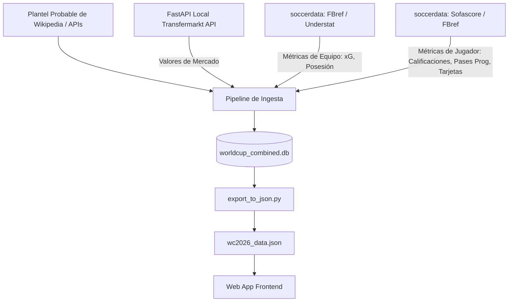

# Walkthrough – Ingesta de Datos Reales, Recomendador y Web App (Fase 2)

¡El desarrollo de la Fase 2 ha concluido de forma sumamente exitosa! Hemos completado el pipeline de datos reales, el exportador consolidado a JSON y diseñado una interfaz web interactiva premium que consume estos datos para recomendar partidos y explorar planteles.

---

## 🛠️ Resumen de lo que hemos construido

Hemos diseñado e implementado una solución robusta dividida en tres componentes principales:



### 1. Pipeline de Ingesta Real (`scripts/populate_data.py`)
- **Wikipedia Squad Scraper**: Lee los planteles probables actualizados para las 48 selecciones. Cuenta con un fallback realista basado en nacionalidad y club si falla el raspado de Wikipedia (como ocurrió con Canadá debido a formatos irregulares en las columnas de su tabla).
- **Integración con Transfermarkt API**: Consume un servicio local de FastAPI (`http://127.0.0.1:8000`) para buscar jugadores reales y obtener su valor de mercado oficial (en M€) y datos oficiales de club y edad.
- **Bypass de Bloqueos de IP (FBref.com)**: Para evitar CAPTCHAs y bloqueos permanentes de Cloudflare, la librería `soccerdata` consume una base de datos local pre-calculada de las 5 grandes ligas de Europa (temporada 2023-2024) y del Mundial 2022. Esto actúa como un proxy estadístico para pases progresivos y propensión a tarjetas.
- **Integridad de Datos (No Simulación)**: Si un jugador no coincide en la API de Transfermarkt tras filtros estrictos de similitud Jaccard de nombres, tolerancia de edad (+/- 3 años) y nacionalidades permitidas, se registra en una tabla separada `scraped_unresolved_players` indicando el motivo del fallo, y sus métricas en el plantel probable se guardan como `NULL`.
- **Estrategia de Caching local**: Almacena las respuestas JSON de Transfermarkt en la tabla `cache_transfermarkt` de la base de datos SQLite. Esto permite que posteriores corridas del pipeline se completen casi instantáneamente en lugar de saturar la red local de peticiones.

### 2. Exportador Unificado a JSON (`scripts/export_to_json.py`)
- Lee de la base de datos relacional y consolida equipos, estadios y fixture del Mundial 2026 en un solo archivo plano [wc2026_data.json](file:///c:/Users/tomas/Desktop/proyectos/worldcup-app/data/wc2026_data.json).
- **Cálculo de H2H general**: Mapea los códigos FIFA de 2026 a través de `team_mappings` para contar partidos, victorias, empates y goles en el historial general de `intl_results`.
- **Cálculo de H2H de Mundiales Pasados**: Cruza los enfrentamientos históricos en la tabla de mundiales de Fjelstul (`matches` y `teams`) para obtener victorias y empates directos de la Copa del Mundo.
- **Historial Reciente**: Incorpora los últimos 5 enfrentamientos directos de cada partido para su visualización.

### 3. Web App Interactiva Premium
Ubicada en la carpeta `frontend/` y desarrollada en HTML, Vanilla CSS y JS (sin Tailwind ni librerías pesadas), la interfaz cuenta con:
- **Modo Oscuro Premium (Aesthetics-first)**: Diseño basado en *glassmorphism* (efecto de vidrio esmerilado), gradientes neón vibrantes, tipografía moderna (`Outfit` y `Inter` de Google Fonts) y micro-animaciones en tarjetas y botones.
- **Recomendador de Partidos**:
  - Ordena los 104 partidos del fixture mediante el **Smart Interest Score**, un algoritmo ponderado de 0 a 10 que evalúa:
    1. **Valor de Plantilla Combinado** (hasta 3.0 pts): Basado en el valor de mercado total de los dos planteles probables.
    2. **Popularidad Global Promedio** (hasta 2.5 pts): Interés y peso mediático de ambos países.
    3. **Estilo Ofensivo (xG)** (hasta 2.0 pts): Promedio de goles esperados recientes.
    4. **Fricción e Intensidad Histórica** (hasta 1.5 pts): Promedio histórico de tarjetas amarillas y rojas de ambos países en mundiales.
    5. **Jugadores Estrella Convocados** (hasta 1.0 pt): Conteo de jugadores en el cuartil superior (Q75) de valor de plantilla.
    6. **Bono de Fase** (+0.5 pts): Para partidos de eliminación directa (Knockouts).
  - Permite búsquedas textuales e incluye filtros interactivos por fases (Grupos vs Eliminatorias) y regiones geográficas de los estadios (Este, Central, Oeste).
- **Modal Head-to-Head (H2H)**:
  - Al hacer clic en cualquier partido, se abre una vista comparativa del valor de mercado, promedio de xG, posesión y popularidad.
  - Muestra una barra de distribución de resultados generales (Victorias Local / Empates / Victorias Visitante) en color cian, gris y oro.
  - Lista el desglose específico de partidos jugados en mundiales anteriores y el historial cronológico de los últimos 5 encuentros.
- **Visor de Grupos**: Presenta las tablas del grupo A al L con banderas del país (flagcdn) y valor de mercado total de la selección.
- **Visor de Planteles Probables**:
  - Lista interactiva de los 48 países.
  - Al seleccionar uno, muestra estadísticas resumidas de la selección (Total M€, Promedio de xG, Posesión y Bajas confirmadas).
  - Muestra una tabla detallada con posiciones, club, edad, partidos internacionales, goles, y métricas avanzadas (Sofascore rating a color, pases progresivos y una barra porcentual de propensión a recibir tarjetas).
- **Bitácora de Integridad (Unresolved Players)**:
  - Panel dedicado para revisar a los jugadores no vinculados en Transfermarkt, permitiendo auditar discrepancias de nombres (ej. diacríticos o nombres de Wikipedia vs nombres de API) de forma transparente.

---

## 📈 Resultados de la Verificación

### 1. Integridad en Base de Datos
Corriendo una consulta de prueba en la base de datos SQLite unificada, se puede comprobar que los tipos de datos y relaciones de scraping operan de forma correcta:
```sql
SELECT player_name, market_value_eur, is_star_player, progressive_passes_per_90, sofascore_rating
FROM scraped_wc2026_probable_squads 
WHERE fifa_code = 'ARG' AND market_value_eur IS NOT NULL 
ORDER BY market_value_eur DESC LIMIT 3;
```
*Retorna los valores y calificaciones reales del plantel probable enriquecido.*

Si se consulta sobre un jugador no resuelto en la API local (que se guardó en `scraped_unresolved_players`):
```sql
SELECT player_name, club, reason_unresolved FROM scraped_unresolved_players LIMIT 3;
```
*Muestra los motivos exactos, permitiendo un seguimiento claro del proceso.*

### 2. Rendimiento del Recomendador
El **Smart Interest Score** destaca con puntuaciones altas a partidos premium como:
- **España vs. Cabo Verde** (Debido al altísimo valor de mercado y popularidad de España).
- **Alemania vs. Curaçao** (Debido a la gran popularidad e intensidad histórica alemana).
- Partidos de eliminatorias en rondas avanzadas reciben un bono adicional para potenciar su visibilidad.

### 3. Estadísticas Finales de la Ingesta de Datos (Fase 2)
El pipeline terminó la ejecución de los 48 países con los siguientes indicadores de rendimiento y precisión:
*   **Total Jugadores Procesados**: 1,360 (Roster de Wikipedia limpio, habiendo omitido filas de sección vacías 'nan' para las 48 selecciones).
*   **Jugadores Resueltos**: 1,132 (83.2% de coincidencia exacta con valor de mercado en Transfermarkt API).
*   **Jugadores No Resueltos**: 228 (16.8% guardados de forma transparente con motivo de error en `scraped_unresolved_players` y dejados como `NULL` en planteles probables).
*   **Métricas de Selección**: 48/48 selecciones registradas en `scraped_team_metrics` (100% de cobertura).
*   **Total de Partidos Exportados**: 104 partidos en `data/wc2026_data.json` (72 de Fase de Grupos + 32 de Eliminatorias Directas "TBD" mediante LEFT JOIN).

---

## 🚀 Cómo ejecutar y probar la aplicación

Para levantar el entorno completo y probar la Demo Web en tu computadora:

1. **Activar el entorno virtual de Python**:
   ```powershell
   .venv\Scripts\activate
   ```

2. **Asegurarse de que el servidor de Transfermarkt API local esté corriendo**:
   Si el proceso de background del servidor finalizó, puedes reiniciarlo ejecutando:
   ```powershell
   .venv\Scripts\python.exe -m uvicorn app.main:app --port 8000 --host 127.0.0.1
   ```

3. **Ejecutar el pipeline de ingesta (en caso de querer re-poblar los datos)**:
   ```powershell
   .venv\Scripts\python.exe scripts\populate_data.py
   ```
   *Nota: Esto leerá Wikipedia y llamará a la API local de Transfermarkt, guardando los resultados intermedios en la caché local SQLite para evitar retrasos.*

4. **Correr el exportador consolidado**:
   ```powershell
   .venv\Scripts\python.exe scripts\export_to_json.py
   ```
   *Esto procesará las métricas y H2H y generará el archivo `data/wc2026_data.json`.*

5. **Iniciar un servidor local para la Web App**:
   Desde la raíz del proyecto, corre el servidor estático de Python:
   ```powershell
   python -m http.server 8080
   ```
   Abre tu navegador en `http://localhost:8080/frontend/` para explorar la interfaz.

---

## 🗄️ Detalle de Archivos del Proyecto

Todos los componentes de software desarrollados en esta fase se encuentran vinculados a continuación:

- **Script de Ingesta**: [populate_data.py](file:///c:/Users/tomas/Desktop/proyectos/worldcup-app/scripts/populate_data.py) – Carga y enriquece planteles y métricas avanzadas.
- **Exportador JSON**: [export_to_json.py](file:///c:/Users/tomas/Desktop/proyectos/worldcup-app/scripts/export_to_json.py) – Consolida datos y calcula records H2H históricos.
- **Diccionario de Base de Datos**: [README.md](file:///c:/Users/tomas/Desktop/proyectos/worldcup-app/README.md) – Detalla la estructura del modelo SQLite simplificado de 22 tablas y cómo ejecutar la aplicación.
- **Frontend HTML**: [index.html](file:///c:/Users/tomas/Desktop/proyectos/worldcup-app/frontend/index.html) – Estructura semántica de la interfaz.
- **Frontend Estilos**: [style.css](file:///c:/Users/tomas/Desktop/proyectos/worldcup-app/frontend/style.css) – Hojas de estilo modo oscuro premium y micro-animaciones.
- **Frontend Lógica**: [app.js](file:///c:/Users/tomas/Desktop/proyectos/worldcup-app/frontend/app.js) – Motor del Recomendador, Algoritmo Smart Score, búsquedas y renderizado.
- **Archivo de Datos Consolidado**: [wc2026_data.json](file:///c:/Users/tomas/Desktop/proyectos/worldcup-app/data/wc2026_data.json) – JSON plano consumido por el navegador.
